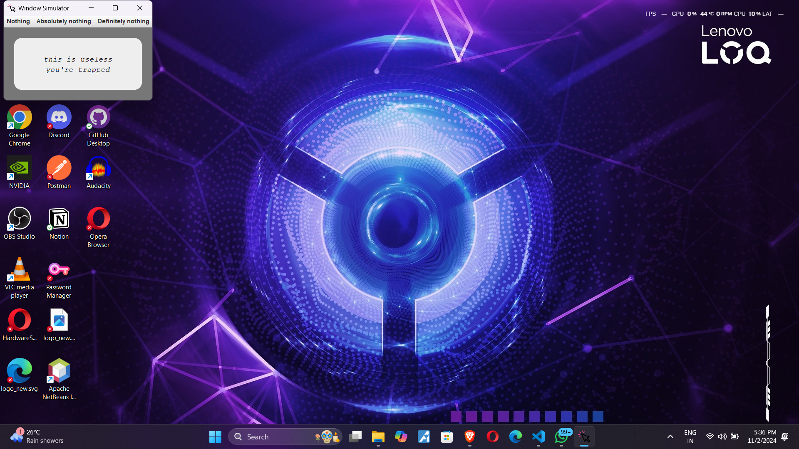
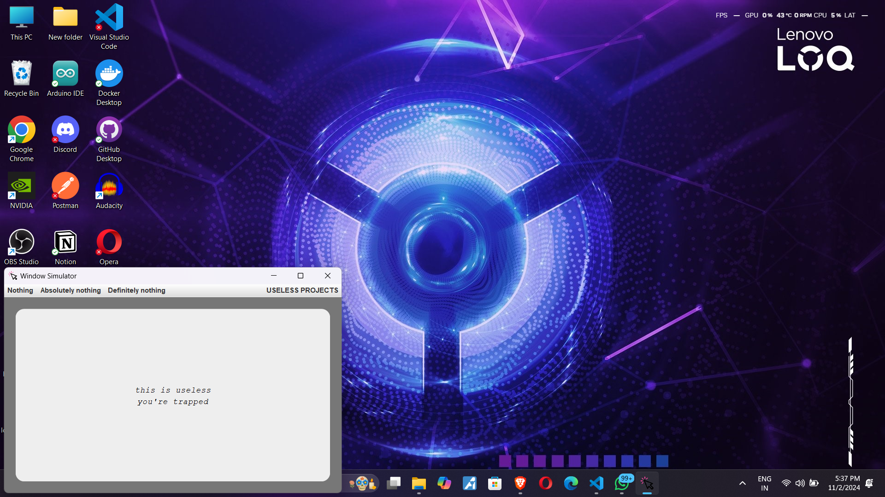
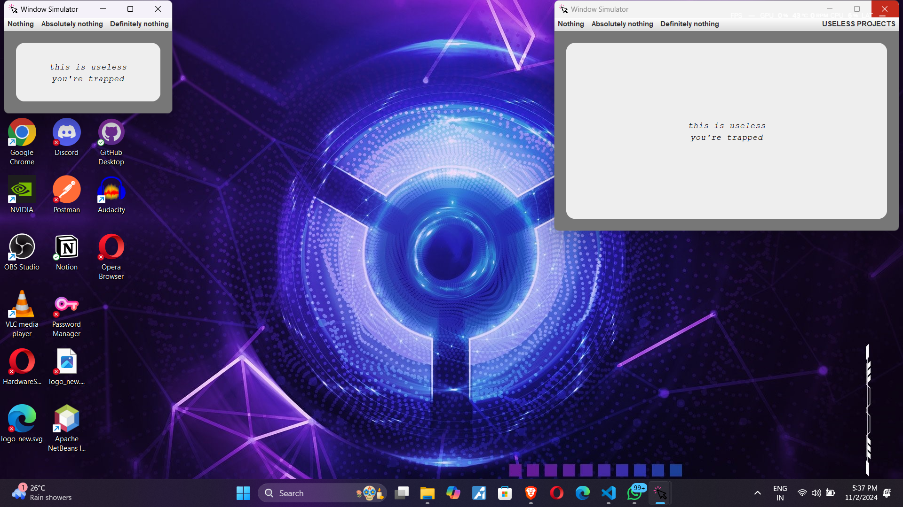

# Crazy Window Simulator

## Basic Details
### Team Name: Byte Rebels

### Team Members
- Team Lead: Akhil S Nair - College of Engineering, Trivandrum
- Member 2: Anavadhya Pradeep - College of Engineering, Trivandrum
- Member 3: Amaljith M V - College of Engineering, Trivandrum

### Project Description
**CRAZY WINDOW SIMULATOR** - A GUI Window acts abnormally. It definitely measures your tolerance.
   Go for [Link](https://www.canva.com/design/DAGVPUPcOmw/IPMvg4igBFcmEW70hOgQ9A/view?utm_content=DAGVPUPcOmw&utm_campaign=designshare&utm_medium=link&utm_source=editor) for more.
   - Absolutely useless.
   - Tests your patience.
   - Made in Java.

### The Problem (that doesn't exist)
People are really fast in controlling the application windows, especially if something fishy is doing there. This saves them a lot at many circumstances.

### The Solution (that nobody asked for)
We just changed the controls of window so its not easier to control it. It will create a bit of confusion.

## Technical Details
### Technologies/Components Used
For Software:
- Java Development Kit
- Swing and awt
- Github Copilot
- Claude.ai

### Implementation
For Software:
# Installation
Clone the repository in local machine which have JDK and IDE installed.

# Run
- Compile WindowSimulator.java
>javac WindowSimulator.java
- Run the program
>java WindowSimulator

### Project Documentation
For Software:

# Screenshots (Add at least 3)

*Window opens with a normal size*

*When tries to maximise the window it jumps to a random position*

*When tries to close it duplicates*

### Project Demo
# Video
[demo](demo.mp4)
*Explain what the video demonstrates*

# Additional Demos
[Presentation](https://www.canva.com/design/DAGVPUPcOmw/IPMvg4igBFcmEW70hOgQ9A/view?utm_content=DAGVPUPcOmw&utm_campaign=designshare&utm_medium=link&utm_source=editor)

## Team Contributions
- Akhil: Ideation
- Anavadhya: Documentation
- Amaljith: Prototype

---
Made with ❤️ at TinkerHub Useless Projects 

